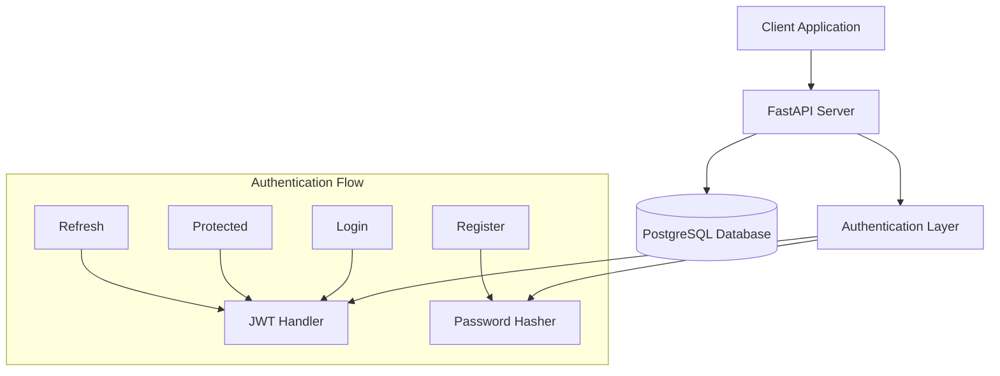
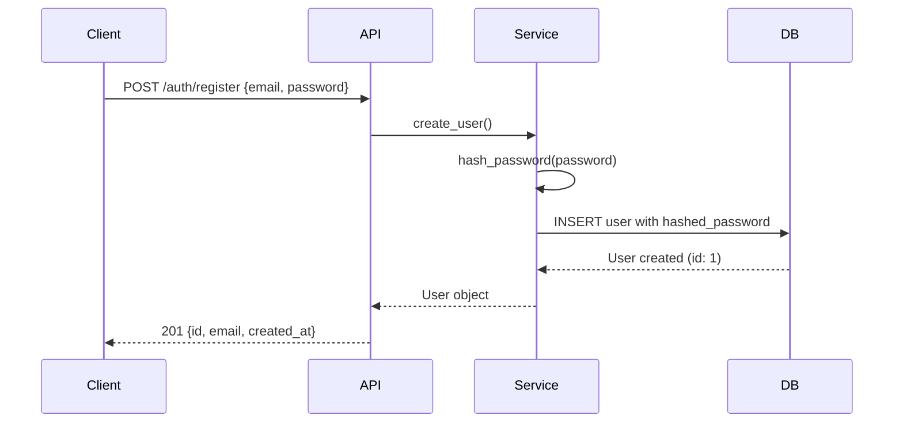
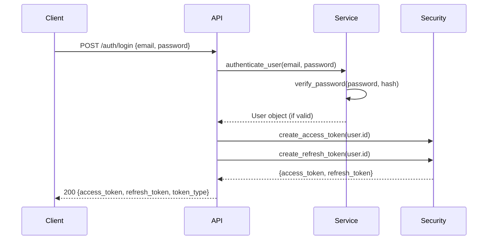
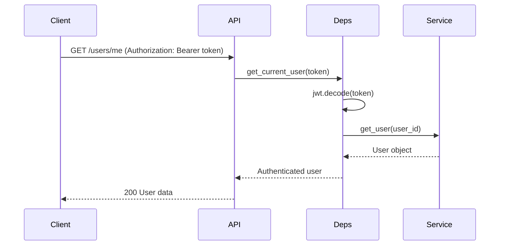
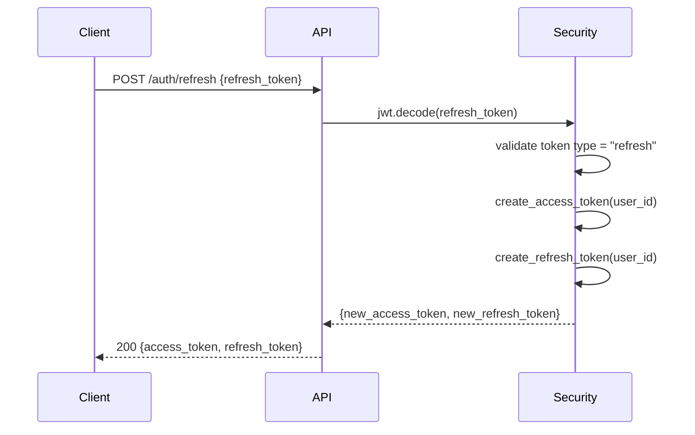

# 🧠 FastAPI Auth Template - Theory & Architecture

This document explains the **theoretical foundations**, **architectural decisions**, and **implementation details** behind this JWT authentication system. Perfect for understanding the "why" behind the code.

---

## 📖 Table of Contents

1. [JWT Authentication Theory](#-jwt-authentication-theory)
2. [System Architecture](#-system-architecture)
3. [Authentication Flow](#-authentication-flow)
4. [Security Considerations](#-security-considerations)
5. [Code Architecture](#-code-architecture)
6. [Database Design](#-database-design)
7. [API Design Patterns](#-api-design-patterns)
8. [Production Considerations](#-production-considerations)

---

## 🔐 JWT Authentication Theory

### What is JWT?

**JWT (JSON Web Token)** is a **stateless authentication** standard that allows secure information transmission between parties as a JSON object.

```
Header.Payload.Signature
```

### JWT Structure

#### 1. **Header** (Algorithm & Type)
```json
{
  "alg": "HS256",
  "typ": "JWT"
}
```

#### 2. **Payload** (Claims/Data)
```json
{
  "sub": "1",           // Subject (user ID)
  "exp": 1640995200,    // Expiration timestamp
  "iat": 1640991600     // Issued at timestamp
}
```

#### 3. **Signature** (Verification)
```
HMACSHA256(
  base64UrlEncode(header) + "." +
  base64UrlEncode(payload),
  secret
)
```

### Why JWT over Session-based Auth?

| **JWT (Stateless)** | **Sessions (Stateful)** |
|-------------------|------------------------|
| ✅ **Scalable**: No server storage | ❌ **Server storage**: Redis/DB required |
| ✅ **Microservices**: Works across services | ❌ **Single server**: Sticky sessions needed |
| ✅ **Mobile-friendly**: No cookies needed | ❌ **Cookie-dependent**: CSRF protection needed |
| ✅ **Decentralized**: Self-contained tokens | ❌ **Centralized**: Session store dependency |
| ❌ **Token size**: Larger than session IDs | ✅ **Compact**: Small session identifiers |
| ❌ **Revocation**: Harder to invalidate | ✅ **Easy revocation**: Delete from store |

---

## 🏗️ System Architecture

### High-Level Architecture



### Component Breakdown

#### 1. **Presentation Layer** (`api/`)
- **Routes**: Handle HTTP requests/responses
- **Validation**: Pydantic schemas validate input
- **Error Handling**: Structured error responses

#### 2. **Business Logic Layer** (`services/`)
- **User operations**: CRUD operations abstracted
- **Authentication logic**: Login, registration, token validation
- **Data transformation**: Between models and schemas

#### 3. **Data Access Layer** (`db/`, `models/`)
- **SQLAlchemy ORM**: Database abstraction
- **Models**: Database table definitions
- **Migrations**: Version-controlled schema changes

#### 4. **Security Layer** (`core/security.py`)
- **JWT generation/validation**: Token lifecycle
- **Password hashing**: Bcrypt for secure storage
- **Dependencies**: Authorization middleware

---

## 🔄 Authentication Flow

### 1. User Registration Flow



**Key Security Points**:
- ✅ **Password never stored in plaintext**
- ✅ **Email uniqueness enforced at DB level**
- ✅ **Input validation** with Pydantic schemas

### 2. Login & Token Generation Flow



**Token Characteristics**:
- **Access Token**: Short-lived (30 min), used for API calls
- **Refresh Token**: Long-lived (7 days), used to get new access tokens
- **Stateless**: No server-side storage required

### 3. Protected Endpoint Access



### 4. Token Refresh Flow



**Why Refresh Tokens?**
- ✅ **Security**: Short access token lifetime limits exposure
- ✅ **UX**: No frequent logins required
- ✅ **Revocation**: Can invalidate refresh tokens when needed

---

## 🛡️ Security Considerations

### Password Security

#### Bcrypt Hashing
```python
# Why bcrypt?
pwd_context = CryptContext(schemes=["bcrypt"], deprecated="auto")

# Cost factor automatically adapts to hardware
# Includes salt generation automatically
# Resistant to rainbow table attacks
```

**Security Features**:
- ✅ **Adaptive cost**: Slows down with better hardware
- ✅ **Built-in salt**: Prevents rainbow table attacks
- ✅ **Industry standard**: Battle-tested algorithm

### JWT Security

#### Secret Key Management
```python
# Environment variables for secrets
SECRET_KEY: str  # Must be cryptographically random
ALGORITHM: str = "HS256"  # HMAC with SHA-256
```

**Best Practices Implemented**:
- ✅ **Environment variables**: Secrets not in code
- ✅ **Strong algorithm**: HS256 for symmetric signing
- ✅ **Token expiration**: Limits exposure window
- ✅ **Type checking**: Refresh tokens include "type" claim

### Attack Prevention

#### 1. **SQL Injection**
- ✅ **SQLAlchemy ORM**: Parameterized queries by default
- ✅ **Input validation**: Pydantic schemas validate all input

#### 2. **Cross-Site Scripting (XSS)**
- ✅ **JWT in headers**: Not in cookies (reduces XSS impact)
- ✅ **JSON responses**: No HTML injection points

#### 3. **Brute Force**
- ⚠️ **Rate limiting**: Not implemented (production consideration)
- ✅ **Strong hashing**: Bcrypt slows down attempts

#### 4. **Token Theft**
- ✅ **Short expiration**: Limits stolen token usage
- ✅ **HTTPS only**: Prevents network interception (production)
- ⚠️ **Token blacklisting**: Not implemented (stateless trade-off)

---

## 🏛️ Code Architecture

### Project Structure Philosophy

```
app/
├── api/              # 🌐 HTTP layer (routes, requests/responses)
├── core/             # ⚙️ Configuration & security primitives
├── db/               # 🗄️ Database connection & base models
├── models/           # 📊 SQLAlchemy models (database schema)
├── schemas/          # 📋 Pydantic models (API contracts)
└── services/         # 🧠 Business logic (pure functions)
```

### Design Patterns Used

#### 1. **Dependency Injection**
```python
# FastAPI's DI system
def get_user_profile(
    current_user: User = Depends(get_current_active_user),
    db: Session = Depends(get_db)
):
    # Dependencies injected automatically
```

**Benefits**:
- ✅ **Testability**: Easy to mock dependencies
- ✅ **Reusability**: Dependencies used across endpoints
- ✅ **Separation**: Business logic separate from HTTP concerns

#### 2. **Repository Pattern** (Services)
```python
# Services abstract database operations
def get_user_by_email(db: Session, email: str) -> Optional[User]:
    return db.query(User).filter(User.email == email).first()
```

**Benefits**:
- ✅ **Abstraction**: Hide database implementation details
- ✅ **Testing**: Easy to mock data layer
- ✅ **Flexibility**: Can switch databases easily

#### 3. **Schema-Driven Development**
```python
# API contract defined by Pydantic schemas
class UserCreate(BaseModel):
    email: EmailStr
    password: str

# Automatic validation & documentation
```

**Benefits**:
- ✅ **Validation**: Automatic input/output validation
- ✅ **Documentation**: Auto-generated OpenAPI/Swagger
- ✅ **Type Safety**: Runtime & static type checking

### Error Handling Strategy

#### HTTP Status Codes
```python
# Consistent error responses
200: Success
400: Bad Request (business logic errors)
401: Unauthorized (invalid/missing token)
403: Forbidden (valid token, insufficient permissions)
422: Validation Error (invalid input format)
500: Internal Server Error (unexpected errors)
```

#### Error Response Format
```json
{
  "detail": "Human readable error message"
}
```

---

## 🗄️ Database Design

### User Model Design

```python
class User(Base):
    __tablename__ = "users"
    
    id = Column(Integer, primary_key=True, index=True)
    email = Column(String, unique=True, index=True, nullable=False)
    hashed_password = Column(String, nullable=False)
    is_active = Column(Boolean, default=True)
    is_superuser = Column(Boolean, default=False)
    created_at = Column(DateTime(timezone=True), server_default=func.now())
    updated_at = Column(DateTime(timezone=True), onupdate=func.now())
```

### Design Decisions

#### 1. **Email as Username**
- ✅ **User-friendly**: People remember emails
- ✅ **Unique**: Natural unique identifier
- ✅ **Validation**: Built-in format validation

#### 2. **Boolean Flags**
- **`is_active`**: Soft delete/account suspension
- **`is_superuser`**: Admin privileges flag

#### 3. **Timestamps**
- **`created_at`**: Audit trail, user analytics
- **`updated_at`**: Track profile changes

#### 4. **Indexing Strategy**
```sql
-- Indexes for performance
CREATE INDEX ix_users_id ON users (id);        -- Primary key lookup
CREATE INDEX ix_users_email ON users (email);  -- Login queries
```

### Migration Strategy

#### Alembic Configuration
```python
# Auto-generation from models
alembic revision --autogenerate -m "Description"

# Version control for database schema
# Rollback capability
# Team collaboration support
```

**Benefits**:
- ✅ **Version control**: Database schema in git
- ✅ **Collaboration**: Consistent schema across team
- ✅ **Rollback**: Can undo schema changes
- ✅ **Auto-generation**: Detects model changes

---

## 🎯 API Design Patterns

### RESTful Design

#### Resource-Based URLs
```
POST   /api/v1/auth/register    # Create user
POST   /api/v1/auth/login       # Authenticate
GET    /api/v1/users/me         # Get current user
PUT    /api/v1/users/me         # Update current user
GET    /api/v1/users/{id}       # Get user by ID
```

#### HTTP Verbs Semantics
- **POST**: Create resources (register, login)
- **GET**: Retrieve resources (read-only)
- **PUT**: Update resources (idempotent)
- **DELETE**: Remove resources (not implemented)

### Versioning Strategy

#### URL Versioning
```
/api/v1/auth/login    # Version 1
/api/v2/auth/login    # Future version 2
```

**Benefits**:
- ✅ **Backward compatibility**: V1 keeps working
- ✅ **Clear contracts**: Each version has defined behavior
- ✅ **Migration path**: Gradual client updates

### Response Consistency

#### Success Responses
```json
// Single resource
{
  "id": 1,
  "email": "user@example.com",
  "created_at": "2024-01-01T10:00:00Z"
}

// Token response
{
  "access_token": "jwt_here",
  "refresh_token": "jwt_here", 
  "token_type": "bearer"
}
```

#### Error Responses
```json
// Validation error
{
  "detail": [
    {
      "loc": ["body", "email"],
      "msg": "field required",
      "type": "value_error.missing"
    }
  ]
}

// Business logic error
{
  "detail": "User already exists"
}
```

---

## 🚀 Production Considerations

### Performance Optimizations

#### 1. **Database Connection Pooling**
```python
# SQLAlchemy manages connection pool
engine = create_engine(
    DATABASE_URL,
    pool_size=10,        # Connection pool size
    max_overflow=20      # Additional connections
)
```

#### 2. **Async Support** (Future Enhancement)
```python
# FastAPI supports async/await
async def get_user(user_id: int):
    # Non-blocking database operations
    return await database.fetch_one(query)
```

### Security Enhancements

#### 1. **Rate Limiting** (Not Implemented)
```python
# Future: slowapi or similar
@limits(calls=5, period=timedelta(minutes=1))
def login():
    # Prevent brute force attacks
```

#### 2. **CORS Configuration**
```python
# Already implemented
app.add_middleware(
    CORSMiddleware,
    allow_origins=settings.BACKEND_CORS_ORIGINS,
    allow_credentials=True,
    allow_methods=["*"],
    allow_headers=["*"],
)
```

#### 3. **HTTPS Enforcement** (Production)
```python
# Production: Use reverse proxy (nginx)
# Redirect HTTP to HTTPS
# HSTS headers
```

### Monitoring & Logging

#### 1. **Health Checks**
```python
@app.get("/health")
def health_check():
    return {"status": "healthy"}
```

#### 2. **Structured Logging** (Future)
```python
# JSON logs for production
logger.info("User login attempt", extra={
    "user_id": user.id,
    "ip_address": request.client.host,
    "user_agent": request.headers.get("user-agent")
})
```

### Scalability Considerations

#### 1. **Stateless Design**
- ✅ **Horizontal scaling**: Add more server instances
- ✅ **Load balancing**: No session affinity needed
- ✅ **Microservices**: JWT works across services

#### 2. **Database Optimization**
```sql
-- Future optimizations
CREATE INDEX CONCURRENTLY idx_users_created_at ON users(created_at);
-- Partitioning for large tables
-- Read replicas for scaling reads
```

#### 3. **Caching Strategy** (Future)
```python
# Redis for caching
# User profile caching
# Rate limit counters
# Blacklisted tokens (if needed)
```

---

## 📚 Educational Value

### Why This Architecture?

#### 1. **Industry Standards**
- **JWT**: Used by Google, Facebook, Auth0
- **FastAPI**: Modern Python web framework
- **SQLAlchemy**: De facto Python ORM
- **Pydantic**: Type validation standard

#### 2. **Scalability Patterns**
- **Microservices ready**: Stateless authentication
- **Cloud native**: 12-factor app principles
- **Container friendly**: Docker support

#### 3. **Developer Experience**
- **Auto-documentation**: Swagger/OpenAPI
- **Type safety**: Static and runtime validation
- **Testing friendly**: Dependency injection

### Learning Outcomes

By studying this codebase, you'll understand:

- ✅ **JWT authentication** theory and implementation
- ✅ **REST API design** best practices
- ✅ **Database modeling** and migrations
- ✅ **Security patterns** for web applications
- ✅ **Modern Python** frameworks and tools
- ✅ **Production considerations** for web APIs

---

## 🔗 Further Reading

### JWT & Security
- [JWT.io](https://jwt.io) - JWT debugger and information
- [OWASP JWT Security](https://cheatsheetseries.owasp.org/cheatsheets/JSON_Web_Token_for_Java_Cheat_Sheet.html)
- [JWT Best Practices](https://auth0.com/blog/a-look-at-the-latest-draft-for-jwt-bcp/)

### FastAPI & Python
- [FastAPI Documentation](https://fastapi.tiangolo.com)
- [Pydantic Documentation](https://pydantic-docs.helpmanual.io)
- [SQLAlchemy Tutorial](https://docs.sqlalchemy.org/en/14/tutorial/)

### Architecture & Design
- [Clean Architecture](https://blog.cleancoder.com/uncle-bob/2012/08/13/the-clean-architecture.html)
- [12-Factor App](https://12factor.net)
- [REST API Design Guidelines](https://restfulapi.net)

---

This theory guide demonstrates not just **what** the code does, but **why** it's designed this way and **how** it fits into modern web development practices. Perfect for showcasing technical understanding in a portfolio context! 🚀 